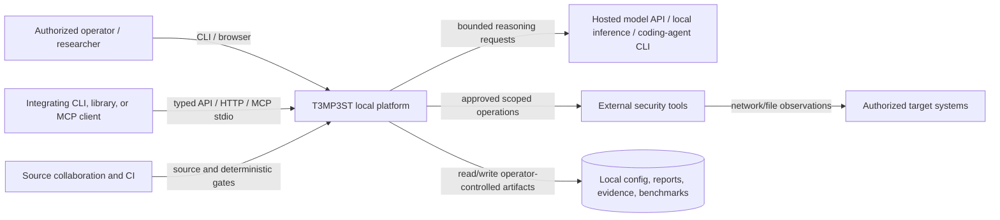
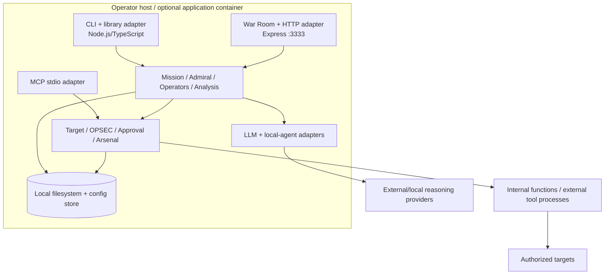
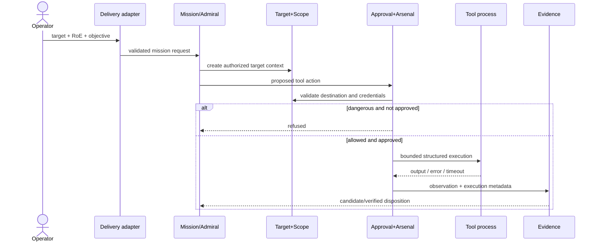
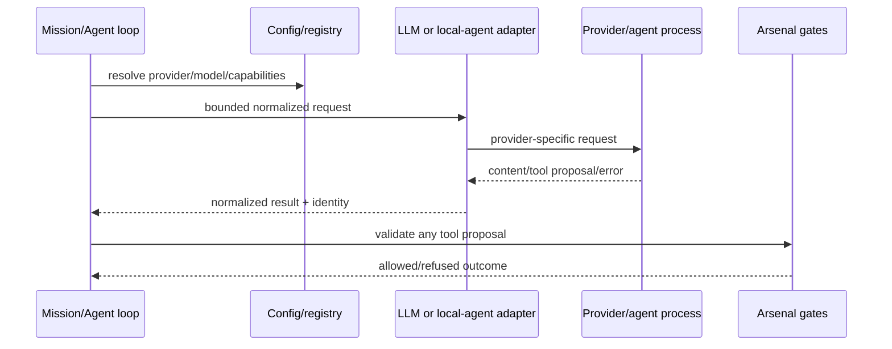
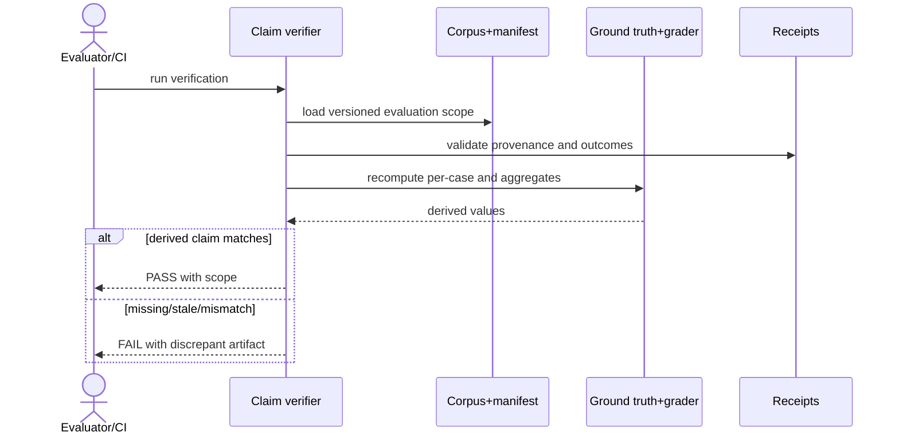

# Software Architecture Document — Current-State Baseline

## Reasoning

1. **Core challenge:** Coordinate tool-backed offensive-security work through several user/provider surfaces while keeping authorization, scope, credentials, evidence, and claims deterministic and reviewable.
2. **Constraints:** Local-first Node/TypeScript distribution; one runtime/package; external models and tools; filesystem artifacts; no hosted-service control plane; mixed stable/experimental/research maturity.
3. **Alternatives:** A distributed service architecture was rejected for the current baseline because it introduces identity, state, deployment, and failure complexity without evidenced fleet requirements. Prompt-only safety was rejected because it cannot authorize execution.
4. **Rationale:** A modular monolith with delivery/provider/tool adapters fits the implemented code and local operator model. Deterministic controls remain below model reasoning.
5. **Primary risks:** Scope or credential bypass, unsafe adapter coupling, prompt/content injection, evidence confusion, and over-generalized capability claims. ADR-003 through ADR-005 govern their controls.

## 1. Executive Summary

T3MP3ST is a local-first offensive-security platform for authorized testing, research, and education. It connects a model or authenticated coding agent to mission planning, role-specific operators, real reconnaissance/exploitation tools, evidence handling, finding verification, and reporting. Operators use a CLI, library, localhost War Room/HTTP API, or a deliberately narrower MCP tool.

The current architecture is a **modular TypeScript monolith with ports/adapters characteristics**. Delivery adapters translate surface input into shared mission/domain operations; reasoning adapters translate provider/local-agent protocols; arsenal adapters translate approved tool intents into internal functions or bounded subprocesses. Configuration, mission state, reports, evidence, and benchmark artifacts are local/in-process/filesystem-backed; no application database or distributed queue is part of this baseline.

The most consequential decisions are local-first modular deployment (ADR-001), provider-neutral/untrusted reasoning (ADR-002), deterministic scope and approval below model output (ADR-003), evidence-derived public claims (ADR-004), and separation of implemented current state from research vision (ADR-005).

The critical residual risks are an adapter bypassing scope/approval, secrets or sensitive evidence escaping, imported/model content manipulating execution, and experimental results being presented as stable capability. Negative safety tests, redaction, evidence/claim gates, maturity labels, and architecture review reduce but do not eliminate these risks.

## 2. Architectural Goals and Constraints

| Driver | Source | Architectural impact |
| --- | --- | --- |
| Conduct a scoped mission | UC-001; NFR-01/02/05 | Target context and deterministic scope/approval/origin gates precede tool dispatch. |
| Support diverse reasoning backbones | UC-002; ADR-002 | Configuration and LLM/local-agent adapters isolate provider differences. |
| Preserve surface parity without privilege expansion | UC-003; NFR-04/07 | CLI/library/HTTP/MCP are adapters over shared modules; HTTP defaults loopback; MCP is narrow. |
| Analyze source with evidence and containment | UC-004; NFR-08/09/11 | Bounded ingest, parser/source locations, explicit experimental maturity. |
| Reproduce claims | UC-005; NFR-03/09 | Versioned corpora/receipts/graders and CI gates are product components. |
| Local-first portability | ADR-001; NFR-06 | Node.js 18+, one package/runtime, filesystem artifacts, optional Docker. |
| Honest evolution | ADR-005; NFR-12 | New persistence, privilege, distributed/autonomous, or maturity boundaries trigger ADR/SAD updates. |

Unknown active-user counts, hosted-service SLOs, fleet concurrency, maintainer capacity, and regulated deployment obligations are not converted into architecture requirements. The current operator estimate of thousands to tens of thousands of users is planning context, not measured telemetry.

## 3. System Context (C4 Level 1)



Trust boundaries exist at browser→localhost server, client→HTTP/MCP adapter, runtime→provider/local agent, orchestration→tool process, tool→target network, runtime→local artifacts, and repository→third-party corpora. Local deployment does not make these inputs trusted.

## 4. Container View (C4 Level 2)



| Container | Deployment unit | Responsibility | Protocol / exposure |
| --- | --- | --- | --- |
| CLI/library | `t3mp3st` Node package/process | Terminal and typed composition entry points | Local process calls |
| War Room/HTTP | Same Node package/process; optional Docker service | Browser UI and JSON API | HTTP/1.1, `127.0.0.1:3333` by default |
| MCP | Same package, separate stdio process mode | Narrow `security_recon` tool | MCP over stdio |
| Core/runtime | In-process modules | Mission state, planning, operators, analysis | TypeScript calls/events |
| External tools | Bounded child processes or internal implementations | Real security operations | Structured argv/stdout/stderr; target protocols |
| Local artifacts | Host/container-mounted paths and config store | Config, reports, evidence, receipts | Filesystem; operator permissions |

## 5. Component View and Interface Inventory

| Component | Responsibility | Primary collaborators | Exposed seam / test mode |
| --- | --- | --- | --- |
| `MissionControl` / `TaskQueue` | Mission lifecycle and task state | Admiral, operators, arsenal | EventEmitter interfaces; unit/integration tests |
| `Admiral` | Convert operator intent into authorized mission brief/directive | LLM backbone, mission | Class and pure conversion helpers; mocked LLM |
| `OperatorAgent` / `OperatorCell` | Role-specific task execution and coordination | LLM, arsenal, mission | Event interfaces; mock backbone or controlled tools |
| `LLMProviderAdapter` / `LLMBackbone` | Normalize hosted/local reasoning | Config, agent loop | Adapter interface; provider contract/mocks |
| Local-agent adapter | Discover and invoke Claude/Codex/Hermes CLIs | Config, mission | Executable/process boundary; fixture binaries/mocks |
| `TargetEnvironment` | Authorized target state and normalization | Mission, arsenal | Class/factory functions; direct unit tests |
| `Arsenal` / `ToolAdapter` | Catalog, scope check, dispatch, parse | Approval, target, subprocesses | Adapter metadata/interface; fixture outputs |
| `ApprovalController` | Risk-based approval state | HTTP/UI, arsenal | Policy/controller interface; deterministic unit tests |
| `EvidenceVault` / live gate | Evidence/finding lifecycle, redaction, verification gate | Analysis, reporting | Events and pure gate helpers; integrity/redaction tests |
| `DecompositionOrchestrator` | Parallel code/query decomposition and synthesis | LLM, context packs | Event interface and typed results; mock providers |
| Delivery adapters | Parse/validate input and shape output | Shared components | CLI/HTTP/MCP contracts; static/integration tests |

Interfaces without an external process boundary still share memory and failure domain. External tool subprocesses are not trusted merely because they are separate; their argument, timeout, exit, and parse contracts require tests.

## 6. Data Model and Classification

The canonical domain types live in `src/types/index.ts`; component-specific interfaces live beside their implementations. Representative logical entities are:

```typescript
type MissionState = {
  id: string;
  target: Target;
  rulesOfEngagement: RulesOfEngagement;
  tasks: Task[];
  status: string;
};

type ToolExecution = {
  tool: string;
  context: ToolContext;
  startedAt: Date;
  completedAt?: Date;
  result?: ToolResult;
};

type Finding = {
  id: string;
  title: string;
  severity: Severity;
  evidence: Evidence[];
  verificationState: string;
};
```

| Entity / store | Location | Classification | Durability and constraints |
| --- | --- | --- | --- |
| Provider settings/API keys | `conf` store / environment | Restricted | Local; values never committed or logged |
| Target headers/credentials | Target configuration | Restricted | Exact-origin use; redacted representations only |
| Mission/task state | Process memory and selected artifacts | Internal/Confidential | Process-lifetime unless explicitly persisted |
| Evidence/findings/reports | Local mounted directories | Confidential/Restricted | Operator-controlled retention and backup |
| Benchmark manifests/receipts | `bench/` and retained local staging | Internal/Public or Restricted by corpus | Versioned selectively; sensitive/third-party raw data may remain ignored |
| Browser preferences/state | localStorage | Internal | Browser-profile durability; not authoritative evidence |

There is no relational schema, cache keyspace, or migration framework in the baseline. Configuration migration helpers support legacy settings. Adding a shared database/cache/queue requires schema, migration, backup, tenancy, and data-classification design plus a new ADR.

## 7. Key Sequence Diagrams

### 7.1 Scoped Mission Tool Execution



### 7.2 Provider-Neutral Reasoning



### 7.3 Claim Reproduction



## 8. External API Surface

The HTTP implementation is large; `docs/API_REFERENCE.md` is the route-level inventory. Architectural groups are summarized here.

| Surface / group | Representative entry points | Contract and auth boundary | UC |
| --- | --- | --- | --- |
| CLI | default `interactive`, `setup`, `status`, `test`, `models` | Local process/user; Commander argument validation | UC-002, UC-003 |
| Library | exports from `src/index.ts` | Typed package API | UC-001–UC-004 |
| HTTP health/config | `/health`, `/api/health`, `/api/preflight`, `/api/llm/status` | Loopback Host/origin guards; local operator | UC-003 |
| HTTP mission | `/api/mission/start|stop|pause|resume|status|report` | Request validation plus target/approval gates | UC-001, UC-003 |
| HTTP tools/approval | `/api/tools/*`, `/api/approvals/*`, arsenal routes | Scope, risk classification, explicit approval | UC-001 |
| HTTP white-box | `/api/whitebox/analyze` | Input containment and parser limits | UC-004 |
| HTTP evidence/findings | `/api/evidence`, `/api/findings`, retest routes | Local artifact/evidence policy | UC-001 |
| HTTP agents/providers | `/api/models`, `/api/llm/*`, `/api/agents/local/*` | Provider configuration and bounded subprocess calls | UC-002 |
| MCP | `security_recon` | Input schema; stdio; deliberately narrow | UC-003 |

No general remote-user authentication or multi-tenant authorization system is claimed. Loopback exposure is the default boundary; changing it requires an explicit deployment threat model.

## 9. Deployment and Process Architecture

| Environment | Purpose | Artifact / exposure | Persistence | Owner |
| --- | --- | --- | --- | --- |
| Local development | Build/test/operator use | Node package/process; loopback HTTP optional | Host config/artifacts | Developer/operator |
| CI | Deterministic quality gates | GitHub Actions, Node 22 | Workflow artifacts/caches per policy | Maintainer |
| Local Docker | Reproducible application runtime | Compose service; host binds loopback port | Mounted reports/evidence | Operator |
| Isolated challenge/tool containers | CTF/tool execution | Per-harness containers | Controlled staging/results | Evaluator/operator |
| Hosted staging/production/DR | Not part of current baseline | N/A | N/A | Requires new ADR/SAD |

### 9.1 Process Types and State

| Process | Entry point | Scale/concurrency | State | Shutdown/recovery |
| --- | --- | --- | --- | --- |
| CLI/library | `src/cli.ts` / package API | One invocation; internal tasks | Memory + local artifacts | Process exit; rerun with retained artifacts where supported |
| HTTP/War Room | `src/server.ts` | One local process; async requests/tasks | Memory, config, browser/local artifacts | Explicit mission stop/pause; container/process restart loses volatile state |
| MCP | `src/mcp-server.ts` | One stdio client process | Process-local | Client restarts process |
| External tool | Adapter-built subprocess | Per action, bounded by policy/timeout | stdout/stderr and generated files | Terminate on timeout; classify failure explicitly |
| Connected agent | Local-agent subprocess | Per bounded request | Agent process plus normalized result | Timeout/kill/fallback behavior recorded |

Startup/shutdown/resource targets are not currently measured and therefore are open NFR-11 work. The server binds `T3MP3ST_HOST`/`T3MP3ST_PORT` with `127.0.0.1:3333` defaults outside Docker. Configuration comes from environment and local config with validation/defaults. Logs/diagnostics go to process streams and UI/event channels; no centralized telemetry or SLO error budget exists.

Backing resources are provider URLs, local agent executables, target URLs, SOCKS proxy configuration, and filesystem paths. Their locators come from configuration/arguments; credentials must not be embedded in repository files or forwarded across origin boundaries.

## 10. Cross-Cutting Concerns

### 10.1 Authentication and Authorization

T3MP3ST does not implement general end-user identity/RBAC for a hosted service. Authority comes from the local operator and explicit target/RoE context. Provider credentials authenticate to provider endpoints; target credentials are exact-origin bound. Dangerous tool operations use risk-based approval. Remote/multi-user exposure is outside the baseline.

### 10.2 Cache Architecture

No distributed application cache exists. Browser localStorage and in-process maps are local state, not authoritative shared caches. Any future shared cache requires key, TTL, invalidation, poisoning, classification, and availability design.

### 10.3 Observability

Mission events, diagnostics, health/preflight/doctor/smoke commands, test output, evidence, reports, and benchmark receipts are the current observability surfaces. Errors distinguish validation, provider, timeout, tool/process, parse, and verification outcomes where implemented. Central metrics, distributed tracing, alerting, and hosted SLOs are N/A for the current local baseline.

### 10.4 Configuration and Secrets

Environment variables and the local `conf` store provide settings; model/provider registry code supplies declared defaults/capabilities. Invalid critical settings fail explicitly. API keys and target credentials are restricted data and must be redacted. Release/update behavior protects declared local paths.

### 10.5 Rate Limiting and Resource Control

Per-user remote rate limiting is N/A because the default server is loopback-only. Finite timeouts, ingest limits, task controls, and provider/tool bounds are required resource controls. Any remote shared deployment must add authentication, rate-limit scope/algorithm/storage, quotas, and abuse monitoring.

### 10.6 Error Handling

Adapters validate input and return surface-appropriate errors; untrusted provider/tool output is not success until parsed and, for claims/findings, verified. Retries occur only through declared bounded fallback paths. Sensitive values are redacted. There is no durable distributed dead-letter queue; failed local tasks remain explicit mission/diagnostic outcomes.

## 11. Technology Choices

| Dependency | Version | Purpose | License / policy note |
| --- | --- | --- | --- |
| Node.js | `>=18.0.0` (CI uses 22) | Runtime | Project engine constraint |
| TypeScript | `^5.3.3` | Typed implementation | Apache-2.0 |
| Express | `^4.18.2` | Local HTTP/War Room server | MIT |
| MCP SDK | `^1.25.1` | MCP stdio server | MIT |
| Commander / Inquirer | `^12.1.0` / `^9.2.15` | CLI surfaces | MIT |
| AJV | `^8.20.0` | JSON/schema validation | MIT |
| Undici / socks | `^8.7.0` / `^2.8.9` | HTTP and proxy networking | MIT |
| web-tree-sitter / grammars | `0.25.10` / `0.1.13` | Multi-language structural parsing | MIT / package-specific grammar licenses |
| Vitest / coverage-v8 | `^4.1.9` / `4.1.9` | Tests and coverage | MIT |
| Docker / Compose | Environment-managed | Local/containerized execution | External runtime; pin images/actions per threat model |

`package.json` and the lockfile are authoritative for the complete dependency/version set. License/supply-chain review must use those files; this table records architecturally significant dependencies only.

## 12. UC → Architecture Traceability

| UC | Containers / components | External entry | Verification |
| --- | --- | --- | --- |
| UC-001 | Mission, Admiral, Operators, Target, Approval, Arsenal, Evidence | CLI/library/HTTP mission and tool routes | Scope, approval, credential, mission, evidence tests |
| UC-002 | Config registry, LLM backbone, local-agent adapter | Setup/models, LLM/local-agent routes | Provider, routing, local-agent, fallback tests |
| UC-003 | CLI, library, HTTP/War Room, MCP adapters | All declared surfaces | Build/type, API hardening, validation tests |
| UC-004 | Code ingest, parsers, white-box, analysis, evidence | White-box route/library path | Ingest limit, grammar, adversarial, containment tests |
| UC-005 | Benchmarks, graders, receipts, claim/provenance/anti-fitting gates | Package scripts and CI | Claim/finding/fitting/provenance tests |

## 13. US → Architecture Traceability

| Stories | Implementing components / endpoint groups | Status |
| --- | --- | --- |
| US-01, US-04 | Target, scope, ApprovalController, Arsenal; approval/tool routes | Implemented |
| US-02 | MissionControl, CLI, HTTP mission routes, War Room | Implemented |
| US-03 | Config, provider registry, local-agent adapter/routes | Implemented |
| US-05 | EvidenceVault, live gate, analysis/reporting/verifiers | Implemented |
| US-06 | MCP `security_recon` adapter | Implemented, intentionally narrow |
| US-07 | Ingest, Tree-sitter parsers, white-box analysis | Experimental |
| US-08, US-10 | Claim/provenance/prompt/anti-fitting scripts and CI | Implemented |
| US-09 | README/FEATURES, ADR-005, vision-alignment | Implemented manually; automation gap |

## 14. NFR → Architecture Traceability

| NFR | Tactic / component | Verification |
| --- | --- | --- |
| NFR-01/02/05 | Target context, scope gate, approval, exact-origin credentials | Arsenal scope/approval and target-header/redaction tests |
| NFR-03 | Evidence gate, receipts, claim/finding verification | Claim, finding, provenance CI gates |
| NFR-04 | Loopback bind plus Host/origin guards | Local API hardening tests and Compose review |
| NFR-06/07 | One Node package, typed adapters/contracts | CI build/type/provider/contract tests |
| NFR-08 | Fixtures/mocks/committed receipts; live work separated | Required deterministic CI jobs |
| NFR-09 | Maturity matrix, stub/count honesty, claim verification | Tests plus documentation audit (automation gap) |
| NFR-10 | Protected-path update behavior | Update self-tests |
| NFR-11 | Finite timeouts and bounded ingest | Timeout/fallback/limit tests; percentile baseline open |
| NFR-12 | ADR triggers and traceability matrices | Architecture review and artifact audit |

## Appendix A — Glossary

| Term | Definition |
| --- | --- |
| Arsenal | Catalog and runtime for internal/external security tools. |
| Receipt | Retained structured record supporting an evaluation or claim. |
| RoE | Rules of engagement defining authorized target activity. |
| War Room | Local browser interface served by the HTTP adapter. |
| Current state | Capability supported by implementation/configuration/tests/evidence, not merely vision text. |

## Appendix B — Open Architectural Questions

| # | Question | Owner | Target | Status |
| --- | --- | --- | --- | --- |
| 1 | What are measured source-ingest and concurrent-mission resource/latency baselines? | Test/architecture steward | Construction | Open |
| 2 | Is package repository metadata intentionally different from canonical tracker identity? | Release integrator | Iteration 001 | Open |
| 3 | What machine-checkable format will enforce maturity consistency? | Architecture/evaluation steward | Construction | Open |
| 4 | Is every network-capable adapter mapped to a scope/approval test? | Safety reviewer | Construction | Open |

## Appendix C — Review Incorporation Log

| Date | Reviewer | Feedback | Resolution | Sections |
| --- | --- | --- | --- | --- |
| 2026-07-20 | Brownfield baseline process | Separate implemented architecture from research vision | Accepted; ADR-005 and alignment matrix | 1, 2, 12–14 |
| 2026-07-21 | Artifact standards audit | Add template reasoning, diagrams, interfaces, data, sequences, deployment, matrices, open questions, and citable references | Incorporated | All |

## References

- @.aiwg/requirements/UC-001.md — Scoped mission behavior.
- @.aiwg/requirements/UC-002.md — Provider/local-agent behavior.
- @.aiwg/requirements/UC-003.md — Delivery-surface behavior.
- @.aiwg/requirements/UC-004.md — Source-analysis behavior.
- @.aiwg/requirements/UC-005.md — Claim reproduction behavior.
- @.aiwg/requirements/user-stories.md — Story-level coverage.
- @.aiwg/requirements/nfr-register.md — Quality constraints and pass conditions.
- @.aiwg/architecture/adr-001.md — Local-first modular-monolith decision.
- @.aiwg/architecture/adr-002.md — Provider-neutral reasoning decision.
- @.aiwg/architecture/adr-003.md — Deterministic safety boundary.
- @.aiwg/architecture/adr-004.md — Evidence-derived claim boundary.
- @.aiwg/architecture/adr-005.md — Current-state/vision separation.
- @src/types/index.ts — Canonical domain types.
- @src/server.ts — HTTP implementation and exposure controls.
- @src/mcp-server.ts — MCP contract.
- @package.json — Runtime, scripts, dependency, and license metadata.
- @.github/workflows/ci.yml — Automated quality/evidence gates.
